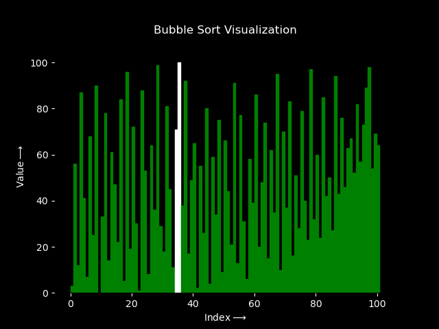

# Bubble Sort CLI (Python, C) 

[](https://www.python.org/downloads/)
[](https://en.wikipedia.org/wiki/C_(programming_language))
[](https://gcc.gnu.org/install/binaries.html)
[](https://code.visualstudio.com/download)
[](LICENSE)

## Table of Contents

- [Bubble Sort CLI (Python, C)](#bubble-sort-cli-python-c)
	- [Table of Contents](#table-of-contents)
	- [Overview](#overview)
	- [What’s here](#whats-here)
	- [Quick start](#quick-start)
	- [Input format](#input-format)
	- [Example usage](#example-usage)
	- [Visualization (Python)](#visualization-python)
	- [Interactive input (Python, C)](#interactive-input-python-c)
	- [Project structure](#project-structure)
	- [Performance \& complexity](#performance--complexity)
	- [Troubleshooting](#troubleshooting)
	- [Contributing](#contributing)
	- [License](#license)
	- [Acknowledgments](#acknowledgments)

## Overview

Simple, educational Bubble Sort tools you can run from the command line. Read numbers from a file, sort them, and get timing + metadata. Includes a Python visualizer for a quick animated view of the algorithm.

## What’s here

- `bubble_sort_cli.py` — Python CLI that sorts numbers from a file and prints results with timing and metadata
- `bubble_sort_cli.c` — C CLI equivalent (fast, single-file build)
- `bubble_sort_visual_cli.py` — Python animation of Bubble Sort using Matplotlib (for demos)
- `InputBubbleSort.py` — Python interactive Bubble Sort that prompts for count and integer inputs from the console
- `InputBubbleSort.c` — C interactive Bubble Sort that prompts for count and integer inputs from the console
- `test_data_*.txt` — Ready-made input files (50 and 100 elements, mixed ordering)
- `LICENSE` — MIT License

## Quick start

- Python (sorting):
	- Prereq: Python 3.8+ installed
	- Run: `python .\bubble_sort_cli.py .\test_data_50_1.txt`

- Python (visualization):
	- Prereq: `pip install matplotlib`
	- Run: `python .\bubble_sort_visual_cli.py .\test_data_50_1.txt`

- C (CLI):
	- You can build manually with GCC/MinGW: `gcc .\bubble_sort_cli.c -o .\bubble_sort_cli.exe`
	- Then run: `.\bubble_sort_cli.exe .\test_data_50_1.txt`


## Input format

- The input file contains numbers separated by commas and/or whitespace (spaces, tabs, newlines).
- Numbers can be integers or floating point.
- The C version parses into doubles and prints compact values using `%g` (so `1` stays `1`, `1.50` becomes `1.5`).

Example (`test_data_mix.txt`):

```
3, 2, 10 5
7, 1  4
```

## Example usage

Python CLI:

```powershell
python .\bubble_sort_cli.py .\test_data_50_2.txt
```

C CLI:

```powershell
# build
gcc .\bubble_sort_cli.c -o .\bubble_sort_cli.exe
```
```powershell
# run
.\bubble_sort_cli.exe .\test_data_50_2.txt
```

Both versions print the same metadata (field names identical):

- Original data: [ ... ]
- Sorted data: [ ... ]
- Sorting took X.XXXXXX seconds
- Sorting algorithm used: Bubble Sort
- Number of elements sorted: N
- Data source: <file>
- Data type: int or float
- Data format: Comma and space-separated values
- Data order before sorting: Unsorted
- Data order after sorting: Sorted
- Data size: N elements

Notes:

- In C, the “Data type” is inferred from the first value (integral within 1e-9 → `int`, otherwise `float`) to mirror the Python display intent.
- Timing uses `clock()` in C and `time.time()` in Python. Absolute values differ across platforms; relative comparisons are still interesting.

## Visualization (Python)

Want to see Bubble Sort in action? The visualizer animates comparisons and the growing sorted tail.

Requirements:

- Python 3.8+
- Matplotlib: `pip install matplotlib`

Run:

```powershell
python .\bubble_sort_visual_cli.py .\test_data_100_1.txt
```

Example Output:
<p align="center">
  
</p>

<p align="center">
  <em>Visualization of 100 elements sorting</em>
</p>

Legend (colors):

- Green: Unsorted portion
- White: Currently compared elements
- Cyan: Already sorted portion

## Interactive input (Python, C)

Prefer typing numbers directly instead of using a file? Use the interactive variants. These prompt for the number of elements and then each element, and print the sorted result. Note: the interactive versions expect integers.

- Python (interactive):

```powershell
python .\InputBubbleSort.py
```

Example session:

```text
Enter the number of elements to be sorted: 5
Enter the elements to be sorted:
9
3
7
1
5

The sorted elements are:
	1    3    5    7    9
```

- C (interactive):

```pwsh
gcc .\InputBubbleSort.c -o .\InputBubbleSort.exe
```
```pwsh
.\InputBubbleSort.exe
```

Notes:

- These interactive programs handle integers only (no floats).
- For file-based sorting with ints and floats, use the CLI tools described above.


## Project structure

```
bubble_sort_cli.c             # C CLI implementation
bubble_sort_cli.exe			  # Built artifact after compiling the C CLI

bubble_sort_cli.py            # Python CLI implementation
bubble_sort_visual_cli.py     # Python visualization with Matplotlib

InputBubbleSort.c             # C interactive (console) version (integers)
InputBubbleSort.py            # Python interactive (console) version (integers)

test_data_50_1.txt            # Sample data (50 integers)
test_data_50_2.txt            # Sample data (50 floating-point)
test_data_100_1.txt           # Sample data (100 integers)
test_data_100_2.txt           # Sample data (100 floating-point)
test_data_mix.txt             # Sample data (mixed int + float)

Example_Figure.png			  # Visualization output

LICENSE                       # MIT license

README.md                     # This file
```

## Performance & complexity

Bubble Sort is O(n²). It’s intentionally simple and great for teaching, but slow on large arrays. Use the provided test files (50–100 elements) for quick demos.

## Troubleshooting

- “python: command not found” → Ensure Python is installed and on PATH. Try `py -V` on Windows, or launch via the Python launcher: `py .\bubble_sort_cli.py <file>`.
- “gcc: command not found” → Install MinGW-w64 or a GCC toolchain and ensure `gcc` is on PATH.
- Matplotlib install issues → Upgrade pip: `python -m pip install --upgrade pip` then `pip install matplotlib`.
 - Interactive programs exit unexpectedly → Enter an integer count first, then the same number of integer values (no commas). The interactive versions do not accept floats.

## Contributing
Contributions are welcome and appreciated! **Here are some ways you can contribute:**

 **Ideas for Contribution**
- Propose new features or improvements.
- Optimize performance or add additional functionality.
- Add more robust input validation and error handling.
- Implement unit tests for the Python script.
- Create a graphical user interface (GUI) for Bubble Sort (e.g., Tkinter/PyQt) or enhance the visualizer.
- Add support for additional languages.

 **Submit Pull Requests**
1. Fork the repository.
2. Create a feature branch: `git checkout -b feature/your-feature`.
3. Make your changes with clear, commented code.
4. Test thoroughly with different inputs.
5. Submit a pull request with a detailed description of your changes.

*Please ensure any code contributions maintain the existing style and include appropriate documentation.*

## License
This project is open source and available under the [MIT License](LICENSE).

## Acknowledgments
- **GCC Compiler**: For compiling the C program.
- **Python Software Foundation**: For providing the Python programming language.
- **Visual Studio Code**: For being an excellent code editor.
- **Shields.io**: For the beautiful badges used in this README.

---
> **Note:** This README.md file was generated with the assistance of AI. While every effort has been made to ensure accuracy and clarity, there may still be minor errors or inconsistencies. Users are encouraged to review the content carefully and make any necessary adjustments.

<div align="center">
  <p>Made with ❤️ by <a href="https://github.com/0PKunal">0PKunal</a></p>
  <p>If this project helped you, please give it a ⭐️</p>
</div>
